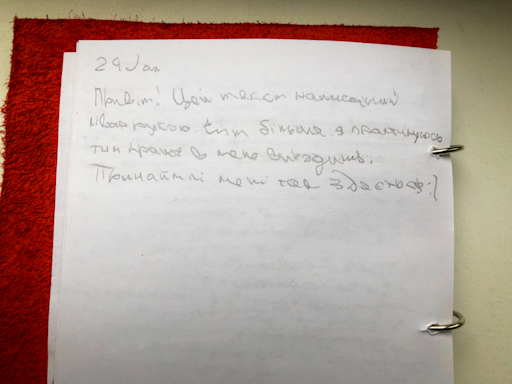

Близько 85-90% людей у світі — правші. Більшість знарядь праці, відпочинку, спорту і всього іншого передбачено для використання правої руки. На виробництвах багато лівшей травмуються, використовуючи стандартне обладнання, бо призначене воно для використання все тієї ж правої. Але звідки виникла ця домінація однієї руки над іншою і чому саме правої над лівою? Як при цьому всьому відчувають себе ті, для кого права рука є "чужою"? З другим питання простіше, тут можна просто знайти знайомого "шульгу" і спитати, а от з першим світ згоди не дійшов. Більшість сходиться на теорії "людини говорючої". Зараз поясню. Вчені визначили, що шимпанзе та інші примати не мають пріоритету в кінцівках, коли стоять на чотирьох, але якщо встають на дві, то тут вже відбувається розподілення на "правих" і "лівих". Але їх порівну — 50/50. Далі вже археологи визначили, на якій стадії еволюції людини почалась така асиметрія і вияснили, що це сталось на етапі "людини говорючої", тобто, коли в людини почали розвиватись мовні функції. За мовні функції відповідає ліва півкуля мозку. І вона ж відповідає за праву сторону людини (відповідно, права півкуля за ліву сторону). Тому в основі цієї теорії, домінування правої руки виникло тільки як побічний ефект розвитку мовного апарату людини. Але на те і придумали слово теорія, щоб описувати ним все те, що не можна довести. Типу, ти знаходиш контраргументи на це, а тобі говорять, ну це ж лише теорія, але вже в наступній бесіді знову видають це за чисту монету.

## Achieved habit

Отже, історія про те, як я на тиждень став амбідекстером (люди, які однаково добре володіють обома руками, таких менше ніж 1% населення, ну і плюс я тепер 😆). Почав з простих тестів на визначення домінуючої руки і через хвилину закінчив. Жоден з них і близько не натякав на мою належність до класу "шульга", навіть прихованого. Особливо раджу тести, в яких треба робити рухи різними руками з максимальною частотою, дуже потішно виглядає і одразу відчуваєш різницю. Тому фокус тижня в мене був прикутий до лівої руки. Починав з делегування їй простих задач. На початку тижня успішно про це забував. Але я вже до цього звик, завжди перші дні нової звички даються не просто. Задачі були тривіальні: чистка зубів, тримання ложки, перегортування сторінок в книзі або ж скрол соціалок. І тривіальними вони були для правої, як тільки за діло бралась ліва, мозок мені видавав характерний синій екран. Після перезавантаження він все ж брався за виконання поставленої задачі, але чули б ви його скрегіт! Господи, неначе в мене там заржавілі шестерінки, якими не користувались уже років з десять. І тепер по пунктах:

1. Відчував себе малою дитиною, яку тільки навчають тримати щось в руці.
2. Всі задачі виконувались набагато повільніше.
3. Ліва рука швидко втомлювалась від найпростіших задач.
4. В перші дні позбивав собі ясна щіткою і ложкою (добре, що обійшлось без порізаних пальців і розбитого посуду).
5. Кожна задача вимагала не аби якої концентрації. Я буквально спостерігав за собою зі сторони та уявляв, як той чи інший рух треба робити лівою рукою (на початку я просто тримав ніж в лівій і на нього правою нанизував банан, щоб його порізати 😂).
6. Написаний лівою рукою текст нагадує ельфійський (чи більше мордорський, мабуть)

Найбільшим моїм здивуванням тижня став той факт, що моя ліва дуже поступається правій навіть в базових задачах. Просте тримання чашки в лівій призводить до дискомфорту і приковує всю твою увагу на одній цій дії. Але така ж історія прослідковувалась і в протилежну сторону. Тобто, є ж заняття, де в нас залучено дві руки, наприклад в душі чи бозна-де ще. І якщо там змінити ролі для рук, права також відчуває себе не комфортно не у своїх задачах. Отже, це просто звичка, яку можна тренувати і розвивати. Чим більше я буду робити так званої дрібної моторики лівою рукою, тим розвиненішою вона стане. І тоді це вірний шлях стати амбідекстером. Але чи корисно це настільки, як здається? Ніхто не може сказати достеменно, чи вроджений амбідекстер відрізняється від набутого, але у вродженого є один суттєвий мінус. Річ у тім, що домінація однієї руки над іншою зумовлено асиметрією мозку, різні його зони відповідають за різні заняття. Мозок може перенаправляти імпульси з однієї зони в іншу, тим самим регулює свою навантаженість. Пам'ятаєш, нам завжди говорили про те, що найкращий відпочинок — це зміна діяльності? От мова саме про це. Одна частина мозку відповідає за розумове навантаження, а інша за фізичне і так далі. Таким чином, ми перенаправляємо імпульси з навантаженої зони в умовно вільну. Не претендую на істину в цьому питанні, але я так зрозумів цей процес. У вроджених амбідекстерів все складніше. В них нема цієї асиметрії і, як наслідок, в них всі зони мозку працюють одночасно. Тому вони швидше втомлюються, гірше концентруються і таке інше, але ж і володіти можуть круто обома руками. Така собі палка з двома кінцями. І обидва праві (амбідекстрія (від лат. ambi — «обидва» і лат. dexter — «правий»))

Робити щось нове не домінантною рукою для мене — це як ходити додому завжди іншими шляхами. Це свого роду еустрес. Він не дає мозку зачерствіти, дозволяє залишатися пластичним і не приносить негативних наслідків для психіки людини. Сюди ж формування нових нейронних зв'язків і вихід із зони комфорту. Кожна така задача змушує повністю на ній сконцентруватись, продумувати кожен рух і спостерігати за собою. І за тиждень такої практики я значно підвищив рівень володіння своєю лівою рукою. І це дуже круто. Також це дає зрозуміти, що означає бути сфокусованим і наводить на той факт, що більшість справ ми вже робимо на автоматі. І життя проживаємо на автопілоті. Але це вже інша історія.

Що по рейтингу? Звичка дуже цікава, багато на що відкриває очі. Без сумніву всім раджу спробувати. Але вона не є чимось надважливим. Я буду і надалі розвивати свою ліву руку, але в загальному вона отримає лише 8.5 з 10 по шкалі корисності для мене.

#### Робота не домінантною рукою — 🌕🌕🌕🌕🌕🌕🌕🌕🌗🌑 (8.5/10)

## Expected habit

Нові звички я вибираю спонтанно. Майже завжди роблю це у вихідні під час написання висновків по попередній. І тут питання не в нестачі ідей, а скоріш навпаки — я просто не знаю, що вибрати з усього розмаїття, щоб мені було цікаво саме зараз. Поміркувавши з хвилину, вирішив, що на наступному тижні я буду слідкувати за своєю мовою. Зараз у мене новий етап в житті, на цьому етапі мені вкрай необхідне живе спілкування, в процесі якого я ставлю багато питань. Щоб це спілкування не "напрягало" моїх співбесідників, хочу навчитись ясно формувати свої думки, не вживати слів паразитів, говорити чітко і зрозуміло, менше використовуючи суржик. Дуже поважаю і захоплююсь людьми, які вміють круто вести діалог. Хочу і сам таким бути. Це не тільки про мову, тут і про вміння активно слухати, і підтримувати контакт, і ще багато різного. Тож я почну з мови, а потім і решту підтягну.
