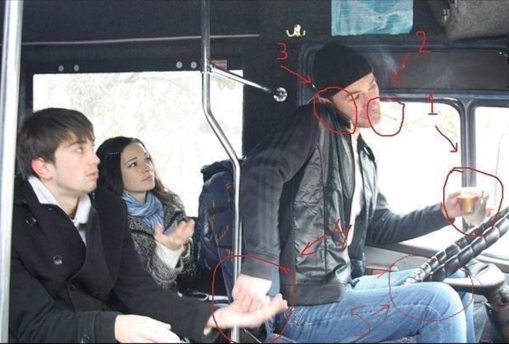

Пройшло вже 5 тижнів мого експерименту. Згідно з планом, я мав набути 5 нових звичок. Час зробити деякі проміжні підсумки та оцінити наскільки вони закріпились у моєму житті.

Перший тиждень був присвячений написанню журналу. Задум був в тому, аби кожного вечора вносити в нього свої враження і думки. Весь січень я списував по одній сторінці та пропустив лише один день. Але далі стало якось напряжніше. Все частіше приходив додому з роботи досить втомленим і диван був моїм надійним притулком. Журнал був на столі. А телефон з простими задоволеннями у вигляді соціальних мереж зовсім поруч. Коротше, я став дедалі частіше забувати або забивати на писання. Зараз вношу туди лише якісь думки з приводу нових звичок. **(failed)**

Наступний тиждень був присвячений роботі над поставою. Ось ця штука закріпилась в мені дуже добре. Хоч інколи я і ловлю себе в сутулому стані, та все ж більшість часу тепер я ходжу з рівною спиною. З сидінням трохи складніше, але і там є прогрес. Рівна спина надає максимально крутий ефект. Відчувається легкість, впевненість, підіймається настрій і з'являється посмішка на обличчі. Дуже задоволений цим покращенням. **(achieved)**

Далі був тиждень експерименту з лівою рукою. Це було дуже не звично і тому круто. Так, це займає більше часу і виглядає, наче ти мавпа з гранатою, але це змушує твої мізки напружуватися і це безумовно круто. На сьогодні я лишив декілька завдань лівій: їм вдома нею, чищу зуби та прості задачі у вигляді маніпулювання з телефоном та інші дрібниці. Також кайфую від цієї звички. **(achieved)**

Наступним був тиждень роботи над своєю мовою. Про неї я не можу робити повноцінних висновків, оскільки задача досить комплексна, а часу пройшло мало. Скажу так, вона в процесі і процес цей буде проходити ще довго. Але я налаштований позитивно. Хочу говорити красиво і цікаво, тому в наступних серіях ще буде. **(in progress)**

Наступний тиждень був присвячений мультизадачності та спробі розібратись чи існує вона взагалі. Про це трохи детальніше мова піде нижче.

Що ми знаємо про Юлія Цезаря без гугла? Римський імператор, який вмів робити декілька справ одночасно і був підло вбитий на зборі свого ж сенату. З сенатом все ясно, просто заздрили всемогутності диктатора. А що ж про багатозадачність? З розповідей його сучасників, імператор міг робити просто нереальні на той час речі. До прикладу, писати, читати і слухати одночасно. В реаліях наших сучасних рекрутерів, такими навичками має володіти кожен кандидат навіть на посаду касира або водія. Хоча секундочку. Якраз там це і необхідно.

## A**chieved habit**

Людської багатозадачності не існує. Принаймні в мене. Власне, я хотів більше підтвердити цей факт, ніж реально вірив в її існування. Я не можу нормально робити дві справи одночасно. Власне, ніхто не може. Те, що називається мультизадачністю — це просто вміння перемикатися з однієї роботи на іншу через малий проміжок часу. Я навмисно в перші дні тижня намагався поєднувати декілька справ. До прикладу, брав в руки телефон під час сніданку. І це виглядало так: погляд в тарілку і захоплення їжі в ложку (це не тривіальна задача, як тобі може здатись, бо я їм лівою тепер), потім погляд в телефон. В ложку. В телефон. Туди-сюди. Туди-сюди. І в кінці такий: а що я там їв? І що я там в телефоні бачив? Це треш... Я просто не відчув і не насолодився їжею, бо відволікавсь в телефон, але і нічогісінько не запам'ятав, що я там бачив, бо відволікався на їжу. Хай йому грець! Або до прикладу, інша ситуація. Їду в автобісі та читаю книгу. Дай, думаю, якраз напишу комусь повідомлення, щоби перевірити як воно буде. Написав, і почав далі читати. Де я там закінчив? Оце читав, оце також. Ага, ось тут. Так, про що тут мова велась? Точно, про перехід людства від мисливців-збирачів до сільськогосподарської революції. Ага, так що там далі? А далі "дзиньььь"... Це в Telegram мені написали відповідь. Та блін, ну тільки ж знайшов де закінчив минулий раз. І так постійно, трясця твоїй матері! (Цей новий лексикон перекочував з минулого тижня, якщо що). І я виніс один єдиний висновок для себе.

> Робити декілька справ одночасно, значить не робити жодної добре.

Я не можу виконувати якусь задачу і при цьому на фоні дивитись відео або слухати подкаст. Єдине, що я можу поєднувати — це прослуховування музики, але якщо це інструментальна або іноземна, де слух не чіпляється за слова і це не змушує мене відволікатись. Вона просто слугує білим шумом. Навіть слухаючи подкасти під час пробіжки, я перестаю слідкувати за тим, як я біжу, з яким темпом і технікою. Тому для себе вирішив, що відтепер буду старатись завжди робити тільки одну справу за раз. Бути повністю на ній сфокусованим. Не відволікатися на перевірку пошти або месенджерів, соціальних мереж або цін на акції гугл кожні 10 хвилин. Для цього я виділяю окремий час. І з задоволенням скролю стрічку Instagram і також ні на що не відволікаюсь.

##### Робити тільки одну справу одночасно — 🌕🌕🌕🌕🌕🌕🌕🌕🌕🌑 (9/10)

## **Expected habit**

А зараз невеличка вправа. Діставай руку і починай загинати пальці, рахуючи тих людей, яких ти можеш назвати друзями зараз. Якщо тобі близько 30-ти, то однієї руки вистачить. Раніше в мене виникало питання, чому і куди зникають друзі. А потім я зрозумів. Дружба — це робота. Для того, щоб її підтримувати, треба докладати зусиль. Інколи достатньо мінімальних, просто подзвонити або написати та щиро спитати "Як справи?". Цим я й хочу зайнятись в наступному тижні, а потім і ввести це в постійну практику. Згадати друзів і рідних, кого давно не бачив і не чув, подзвонити, написати або зустріти наживо. Всі ми створіння соціальні і приємне спілкування робить нас щасливішими.

**PS: Якщо у тебе виникне бажання поспілкуватись зі мною, ти знаєш, де мене знайти, буду радий 😉**
